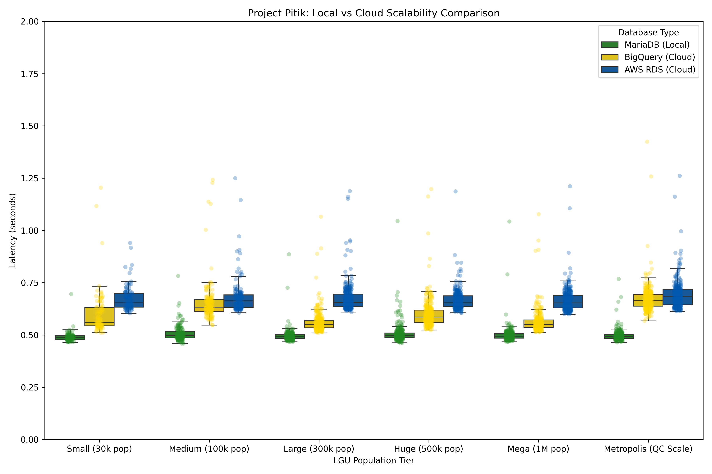
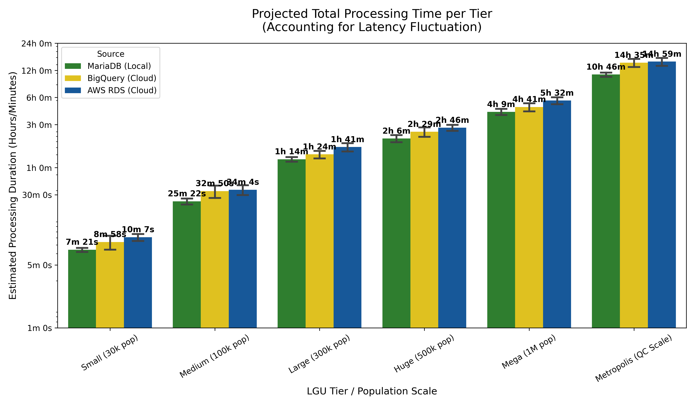

## Pitik Benchmarks and Results

*Version 1.0*

Project Pitik prioritizes operational transparency. This section outlines the rigorous testing conducted to validate the efficiency of a sovereign local‑first architecture against standard cloud‑based data warehouses.

To ensure a high‑fidelity simulation of LGU operations, the system underwent sequential ingestion testing across multiple population tiers.

| Test cases used | Libraries / Components |
| --- | --- |
| End‑to‑End Ingestion | OCR extraction (Tesseract), SHA‑256 hashing, MAC address metadata pairing, database commit. |
| Tiered Sampling | N=100 (Small), N=150 (Medium), N=300 (Large/Metropolis) to observe latency stability at scale. |
| Hardware[1] | MacBook Pro M3 (8GB RAM), AC‑powered (plugged) to prevent CPU throttling during peak execution. |
| Database Comparison | Local sovereign instance (MariaDB) vs. enterprise cloud data warehouses (BigQuery) and managed OLTP (AWS RDS). |

[1] Additional cross‑platform validation (Windows OS) is scheduled for May 25, 2026, to verify consistency across common LGU hardware configurations.

### Results

The benchmarks indicate that local and sovereign ingestion (MariaDB) consistently outperforms both cloud alternatives by eliminating network round‑trip time (RTT) and API handshake overhead.

#### Scalability & Operational Impact

While the per‑transaction latency delta (≈0.15–0.19 s) may seem marginal, it compounds significantly when projected across full‑scale city volumes. The table below shows estimated total processing times for a complete BPLS ingestion cycle (e.g., annual renewal batch), based on the measured per‑record latencies and typical business densities per population tier.

| LGU Tier (Population)               | MariaDB (Local)       | BigQuery (Cloud)      | AWS RDS (Cloud)       | Local advantage vs. BigQuery | Local advantage vs. AWS RDS |
|-------------------------------------|-----------------------|-----------------------|-----------------------|-----------------------------:|-----------------------------:|
| Small (30k)                         | 0h 7m 26.57s          | 0h 8m 23.19s          | 0h 9m 48.60s          | **12.7 % faster**            | **31.8 % faster**            |
| Medium (100k)                       | 0h 24m 53.03s         | 0h 31m 38.61s         | 0h 33m 9.70s          | **27.2 % faster**            | **33.3 % faster**            |
| Large (300k)                        | 1h 13m 45.62s         | 1h 22m 17.07s         | 1h 38m 22.79s         | **11.6 % faster**            | **33.4 % faster**            |
| Huge (500k)[2]           | 2h 3m 59.72s          | 2h 26m 27.51s         | 2h 43m 25.33s         | **18.1 % faster**            | **31.8 % faster**            |
| Mega (1 M)[3]            | 4h 7m 9.74s           | 4h 35m 40.87s         | 5h 26m 36.57s         | **11.5 % faster**            | **32.1 % faster**            |
| Metropolis (3 M)[4]      | 10h 41m 42.23s        | 14h 25m 26.77s        | 14h 48m 48.44s        | **34.9 % faster**            | **38.5 % faster**            |

[2] For 500k population and above, actual Philippine cities are used to provide a more realistic perspective: Iloilo City / General Santos (500k), Antipolo / Pasig / Cebu City (1 M), Quezon City (3 M, “Metropolis”).  
[3] Cloud times for high volumes are extrapolated from successful single‑record API handshakes because free‑tier constraints prevented continuous streaming. Local times are measured from actual batch runs.  
[4] Positive difference indicates faster local ingestion; negative would indicate faster cloud ingestion. Calculations use the assumed number of businesses per tier and the measured per‑record latencies.

### Real‑World Impact

In a high‑density LGU scenario (e.g., Quezon City or Manila), switching from cloud‑dependent workflows to Pitik’s local‑first architecture saves approximately **2 hours 18 minutes** of active processing time per cycle (based on the metropolis tier). For cities like Pasig, Antipolo, or Cebu City, the saving is nearly **one hour** per cycle.

Beyond speed, MariaDB (Local) remains **100 % operational** even during total ISP outages or scheduled power maintenance (with a basic UPS) – a scenario where cloud‑based e‑services would experience **100 % failure**.

> **Note:** The time savings above are calculated for a single document type (e.g., Business Permit applications). When scaled across multiple LGU departments (Health, Engineering, Assessor’s Office), the cumulative administrative recovery could reach **dozens of man‑hours per week**.

### Why Local Beats Both BigQuery and RDS

- **No network round‑trip**: Local inserts bypass internet latency and API overhead.
- **Predictable scaling**: Performance is limited only by local hardware, which can be upgraded cheaply.
- **Offline resilience**: Power or internet outages do not halt operations – a UPS keeps the local server running.
- **Cost efficiency**: No recurring cloud fees; one‑time hardware expense only.