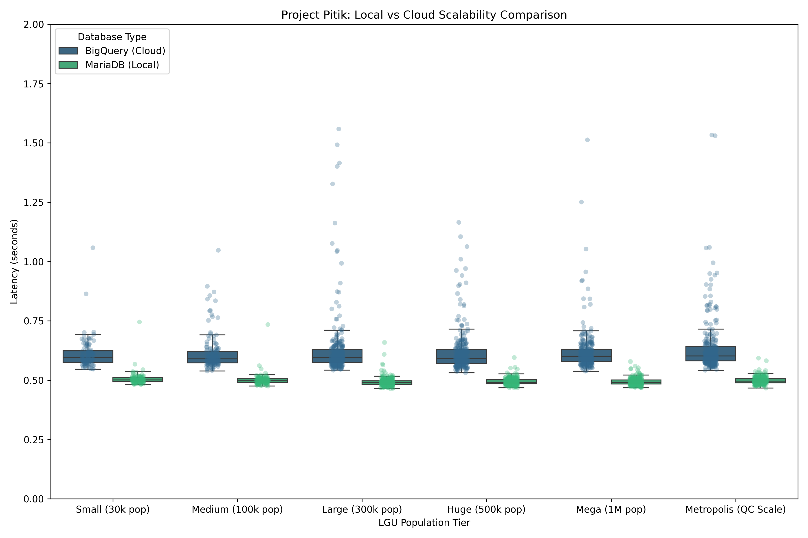
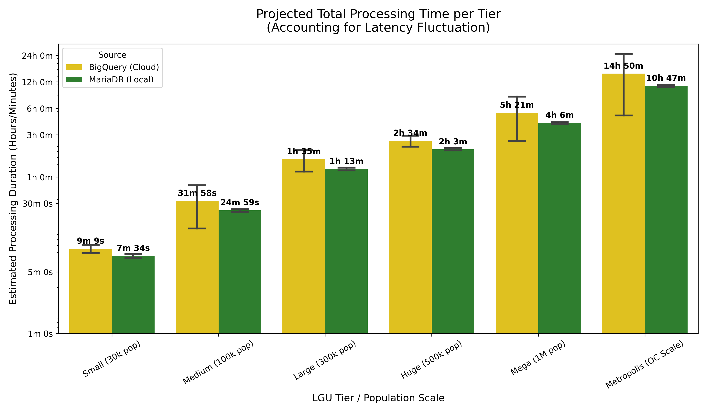

## Pitik Benchmarks and Results

*Version 1.0*

Project Pitik prioritizes operational transparency. This section outlines the rigorous testing conducted to validate the efficiency of a sovereign local-first architecture against standard cloud-based data warehouses.

To ensure a high-fidelity simulation of LGU operations, the system underwent sequential ingestion testing across multiple population tiers.

| **Test cases used** | **Libraries^** |
| --- | --- |
| End-to-End Ingestion | Includes OCR extraction (Tesseract), SHA-256 Hashing, MAC Address metadata pairing, and Database Commit. |
| Tiered Sampling | $N=100$ (Small), $N=150$ (Medium), $N=300$ (Large/Metropolis) to observe latency stability at scale. |
| Hardware^ | Macbook Pro M3 (8GB RAM), AC-powered (Plugged) to prevent CPU throttling during peak execution.^^ |
| Database Comparison | Local sovereign instance vs. Enterprise Cloud Data Warehouse.^^

^ Note: Additional cross-platform validation (Windows OS) is scheduled for May 25, 2026, to verify consistency across common LGU hardware configurations.

^^ Cloud results for high volumes were extrapolated from successful single-record API handshakes, as free-tier constraints prevented continuous streaming

### Results

The benchmarks indicate that local and sovereign ingestion (MariaDB) consistently outperforms cloud alternatives like Bigquery by eliminating network round-trip time (RTT) and API handshake overhead.

+ Local Latency: Average ${\approx}0.49s$ (Stable range: 0.48s – 0.50s)
+ Cloud Latency: Average ${\approx}0.60s$ (Variable range: 0.59s – 0.65s)
+ Efficiency Gain: Pitik achieves a 21% average reduction in per-record latency.

### Scalability & Operational Impact

While the per-transaction latency delta (${\approx}0.15s$) may seem marginal, it compounds significantly when projected across full-scale city volumes.

| LGU Tier^^^                  |   BigQuery (Cloud)   | MariaDB (Local)   | Time Difference (%)   |
|:----------------------|-------------------:|------------------:|-----------------:|
| Small (30k pop)       | 0h 8m 55.84s       | 0h 7m 30.68s      | 18.89%           |
| Medium (100k pop)     | 0h 29m 28.94s      | 0h 24m 50.89s     | 18.65%           |
| Large (300k pop)      | 1h 29m 11.62s      | 1h 13m 21.80s     | 21.58%           |
| Huge (500k pop; Iloilo City/Gensan)       | 2h 27m 53.08s      | 2h 2m 50.07s      | 20.39%           |
| Mega (1M pop; Antipolo/Pasig/Cebu City)         | 5h 0m 28.19s       | 4h 5m 34.08s      | 22.36%           |
| Metropolis (3M pop; Quezon City) | 13h 2m 23.66s      | 10h 44m 38.78s    | 21.37%           |

*Positive time difference indicates faster local ingestion time, negative indicates faster cloud ingestion. Calculation uses assumed number of businesses per tier and each iterations' latencies.*

^^^ For 500k and above, cities in the Philippines are used to get a closer perspective on how much the difference can have an effect.

In a high-density LGU scenario (e.g., Quezon City or Manila), switching from cloud-dependent workflows to Pitik's local-first architecture saves approximately 2 hours and 18 minutes of active processing time per cycle, while for cities like Pasig, Antipolo, or Cebu, local-first saves almost an hour. This optimization allows government personnel to reallocate man-hours toward direct public service rather than waiting for system commits.

Beyond speed, MariaDB (Local) remains 100% operational even during total ISP outages—a scenario where Cloud-based eServices would hit a 100% failure rate.

*Note: The 2.3-hour time saving is calculated based on a single document type (e.g., Business Permit applications). When scaled across multiple LGU departments (Health, Engineering, Assessor's Office), the cumulative administrative recovery could reach dozens of man-hours per week.*